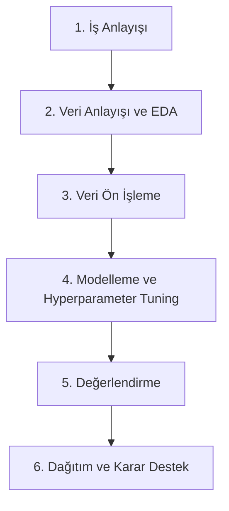

# 🎓 Öğrenci Başarısının Tahmini ve Analizi
### CRISP-DM Metodolojisi ve Makine Öğrenmesi Yaklaşımıyla Karar Destek Sistemi

[](https://www.python.org/)
[](https://streamlit.io/)
[](https://opensource.org/licenses/MIT)

Bu proje; öğrencilerin demografik, sosyal ve akademik özelliklerini analiz ederek dönem sonu başarı durumlarını (**Başarılı / Başarısız**) tahmin eden ve eğitimciler için veri odaklı karar destek mekanizmaları sunan uçtan uca bir veri madenciliği uygulamasıdır. 

Proje kapsamında **CRISP-DM** metodolojisi izlenmiş ve **5 farklı makine öğrenmesi modeli** optimize edilerek karşılaştırılmıştır. Ayrıca, eğitimcilerin gerçek zamanlı tahminler yapabilmesi için modern bir **Streamlit** web arayüzü geliştirilmiştir.

---

## 📌 İçindekiler
* [Öne Çıkan Özellikler](#-öne-çıkan-özellikler)
* [Teknoloji Yığın Yapısı](#-teknoloji-yığın-yapısı)
* [Proje Klasör Yapısı](#-proje-klasör-yapısı)
* [Veri Seti ve Özellikleri](#-veri-seti-ve-özellikleri)
* [CRISP-DM Metodolojisi ve Süreçler](#-crisp-dm-metodolojisi-ve-süreçler)
* [Modelleme ve Performans Sonuçları](#-modelleme-ve-performans-sonuçları)
* [Karar Destek İçgörüleri](#-karar-destek-i̇çgörüleri)
* [Kurulum ve Çalıştırma](#-kurulum-ve-çalıştırma)
* [Katkıda Bulunanlar](#-katkıda-bulunanlar)

---

## 🚀 Öne Çıkan Özellikler

- **Çoklu ML Algoritması**: Rastgele Orman, Karar Ağacı, Lojistik Regresyon, K-NN ve SVM modelleri.
- **Hiperparametre Optimizasyonu**: `GridSearchCV` ve 5-Katlı Stratified K-Fold çapraz doğrulama ile en iyi parametrelerin otomatik seçimi.
- **Veri Dengeleme (SMOTE)**: Sınıf dengesizliğini çözmek için SMOTE entegrasyonu.
- **İnteraktif Web Arayüzü**: Plotly grafik kütüphanesiyle zenginleştirilmiş, responsive Streamlit paneli.
- **Otomatik Raporlama**: Script çalıştırıldığında 11 farklı analitik grafiğin (`grafikler/` klasörüne) ve performans CSV dosyasının otomatik üretilmesi.

---

## 🛠️ Teknoloji Yığın Yapısı

* **Dil**: Python 3.8+
* **Kütüphaneler**: 
  * `scikit-learn` (Model eğitimi ve ön işleme)
  * `pandas` & `numpy` (Veri manipülasyonu)
  * `matplotlib` & `seaborn` (Statik grafikler ve otomatik raporlama)
  * `plotly` (Streamlit üzerindeki dinamik grafikler)
  * `streamlit` (Web uygulama arayüzü)

---

## 📁 Proje Klasör Yapısı

```
VERİ MADDENCİLİĞİ PROJE/
│
├── .streamlit/
│   └── config.toml          # Streamlit karanlık mod/tema yapılandırması
│
├── data/
│   └── student-mat.csv      # UCI Student Performance orijinal veri seti
│
├── grafikler/               # ogrenci_analiz.py tarafından üretilen 11 grafik
│   ├── 01_dagilimlar.png
│   ├── 02_korelasyon.png
│   ├── ...
│   └── 11_karar_destek.png
│
├── utils/                   # Streamlit modülleri
│   ├── __init__.py
│   ├── data_loader.py       # Veri indirme, temizleme ve feature engineering
│   └── models.py            # Modellerin tanımları ve GridSearchCV eğitim akışı
│
├── app.py                   # Streamlit ana web uygulaması çalıştırıcısı
├── ogrenci_analiz.py        # Çevrimdışı CRISP-DM süreçleri ve grafik üretim scripti
├── RAPOR.md                 # Detaylı akademik/teknik proje raporu
├── model_karsilastirma.csv  # Modellerin metrik sonuçlarını içeren veri dosyası
├── requirements.txt         # Gerekli kütüphaneler listesi
└── .gitignore               # Git dışı bırakılacak dosyalar kılavuzu
```

---

## 📊 Veri Seti ve Özellikleri

Projede, UCI Machine Learning Repository'de yer alan **Student Performance** veri seti baz alınmıştır. Veri seti 395 öğrenciyi ve 22 farklı niteliği kapsar:

| Kategori | Özellikler |
|---|---|
| **Demografik** | Yaş, Cinsiyet, Yerleşim Yeri (Kentsel/Kırsal) |
| **Aile** | Anne/Baba Eğitim Düzeyi, Aile Büyüklüğü, Ebeveyn Medeni Durumu |
| **Akademik** | Haftalık Çalışma Süresi, Devamsızlık, Sınıf Tekrarı Sayısı, G1 (1. Dönem Notu), G2 (2. Dönem Notu) |
| **Sosyal & Kişisel** | Alkol Tüketimi (Hafta içi / Hafta sonu), Serbest Zaman, Sosyalleşme, Sağlık Durumu |
| **Destek Yapıları** | İnternet Erişimi, Dershane Desteği, Aile Eğitim Desteği |

> 🎯 **Hedef Değişken (G3)**: Dönem sonu final notudur (0-20 ölçeğinde). Karar destek modelinde, **G3 ≥ 10** olan öğrenciler **Başarılı (1)**, **G3 < 10** olan öğrenciler **Başarısız (0)** olarak sınıflandırılmıştır.

---

## 🔄 CRISP-DM Metodolojisi ve Süreçler

Proje adımları endüstri standardı olan **CRISP-DM** metodolojisine göre tasarlanmıştır:



1. **İş Anlayışı**: Riskli durumdaki öğrencileri önceden tespit edip akademik başarısızlığı önlemeye yönelik bir erken uyarı çerçevesi belirlendi.
2. **Veri Anlayışı (EDA)**: Değişkenlerin dağılımları incelendi, korelasyon analizleri yapıldı. G1 ile G3 notu arasında **0.948** düzeyinde çok güçlü bir korelasyon tespit edildi.
3. **Veri Ön İşleme**: Eksik veri kontrolü yapıldı, kategorik değişkenler `LabelEncoder` ile kodlandı. Ağaç tabanlı olmayan modeller için veriler `StandardScaler` ile ölçeklendirildi. `mutual_info_classif` (Information Gain) kullanılarak özellik önem sıralaması çıkarıldı.
4. **Modelleme**: 5 algoritma, Stratified K-Fold çapraz doğrulama ile GridSearchCV üzerinden en optimum hiperparametrelerle eğitildi.
5. **Değerlendirme**: Modeller Test seti üzerinde doğruluk, kesinlik, duyarlılık, F1-Skoru ve ROC-AUC metriklerine göre karşılaştırıldı.
6. **Dağıtım (Deployment)**: Eğitimcilerin kullanabileceği interaktif tahmin aracı (Streamlit) kuruldu.

---

## 🏆 Modelleme ve Performans Sonuçları

Test kümesi (79 öğrenci) üzerinde elde edilen en iyi model sonuçları şu şekildedir:

| Model | Doğruluk (Accuracy) | Kesinlik (Precision) | Duyarlılık (Recall) | F1-Skoru | ROC-AUC |
|---|---|---|---|---|---|
| 🌲 **Rastgele Orman (Random Forest)** | **0.9241** | **0.9194** | **0.9828** | **0.9500** | **0.9589** |
| ⚡ **Destek Vektör Makinesi (SVM)** | 0.8861 | 0.8889 | 0.9655 | 0.9256 | 0.9548 |
| 📈 **Lojistik Regresyon** | 0.8734 | 0.8871 | 0.9483 | 0.9167 | 0.9507 |
| 🔵 **K-En Yakın Komşu (K-NN)** | 0.8608 | 0.8507 | 0.9828 | 0.9120 | 0.9314 |
| 🌳 **Karar Ağacı (Decision Tree)** | 0.8354 | 0.8462 | 0.9483 | 0.8943 | 0.7360 |

> 💡 **En Başarılı Model**: Tüm metriklerde en dengeli ve yüksek performansı gösteren **Rastgele Orman (Random Forest)** algoritması olmuştur. Özellikle **Duyarlılık (Recall: %98.28)** skorunun yüksek olması, başarısız olma riski taşıyan öğrencilerin neredeyse tamamının sistem tarafından doğru yakalandığını göstermektedir.

---

## 💡 Karar Destek İçgörüleri

Eğitimciler için veri analizinden elde edilen somut bulgular:

- 🔴 **Kritik Eşik (G1 < 10)**: 1. Dönem notu (G1) 10'un altında olan öğrencilerin yıl sonunda başarıya ulaşma oranı yalnızca **%13**'tür. Bu grup öncelikli destek kapsamına alınmalıdır.
- 🔴 **Haftalık Çalışma Süresi (< 2 Saat)**: Çalışma süresi 2 saatten az olan öğrencilerin başarı oranı **%52** iken, 10 saatten fazla çalışanlarda bu oran **%95**'e çıkmaktadır.
- 🟡 **Devamsızlık Sınırı (> 14 Gün)**: 15 gün ve üzeri devamsızlık yapan öğrencilerin başarı şansı **%64**'e düşmektedir.

---

## 💻 Kurulum ve Çalıştırma

Projeyi yerel bilgisayarınızda çalıştırmak için aşağıdaki adımları izleyin:

### 1. Depoyu Klonlayın
```bash
git clone https://github.com/kullaniciadi/ogrenci-basari-tahmini.git
cd ogrenci-basari-tahmini
```

### 2. Gerekli Kütüphaneleri Yükleyin
Sanal ortam oluşturulması tavsiye edilir:
```bash
# Sanal ortam oluşturma (Opsiyonel)
python -m venv .venv
source .venv/bin/activate  # Linux/macOS
.venv\Scripts\activate     # Windows

# Bağımlılıkların yüklenmesi
pip install -r requirements.txt
```

### 3. Çevrimdışı Analiz Scriptini Çalıştırın
Analiz süreçlerini koşturmak, 11 analitik grafiği ve karşılaştırma CSV'sini yerel diskte oluşturmak için:
```bash
python ogrenci_analiz.py
```

### 4. İnteraktif Streamlit Arayüzünü Başlatın
Kullanıcı dostu, interaktif tahmin ve görselleştirme panelini tarayıcınızda açmak için:
```bash
streamlit run app.py
```

Uygulama otomatik olarak tarayıcınızda `http://localhost:8501` adresinde açılacaktır.

---

## 📄 Proje Raporu
Projenin metodolojik arka planı, istatistiksel testleri ve tüm tasarım detayları hakkında kapsamlı bilgi edinmek için **[RAPOR.md](file:///c:/Users/HP/OneDrive/Desktop/projeler/VERİ%20MADDENCİLİĞİ%20PROJE/RAPOR.md)** dosyasını inceleyebilirsiniz.

---
*Bu çalışma, Veri Madenciliği dersi projesi kapsamında CRISP-DM süreçlerini ve makine öğrenmesi uygulamalarını somutlaştırmak amacıyla geliştirilmiştir.*
